# VBIchigoTool

 IchigoJam用プログラムアップ＆ダウンローダ for Windows

## はじめに

**VBIchigoTool** は、Windows 10パソコンとIchigoJam間でのプログラム転送を支援するツールです。

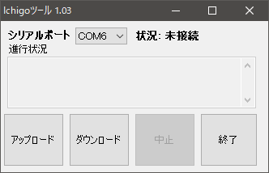  

## 出来ること

- パソコンから指定したテキストファイルの内容を、IchigoJamに転送します。
- IchigoJam上のプログラムを読み込み、パソコンにテキストファイルとして保存します。

## 必要な機器

- IchigoJam
- Windowsパソコン
- USBシリアル変換モジュール(USBケーブルを含む)
- IchigoJamに接続するためのジャンパーワイヤー等（適宜）

## ツールのインストール

- インストール作業は不要です。  
解凍したbin下にあるIchigotool.exeをお好きなフォルダに保存して利用いて下さい。
- 環境によては、ランタイムモジュール等のインストールが必要となります。
- USBメモリ等の保存メディアに入れて利用することも可能です。  
- ディスクへのショートカットの作成、メニュー登録を適宜行って下さい。

## ツールのアンインストール

- Ichigotool.exeファイルを削除して下さい。

## 接続

USBシリアル変換モジュールをIchigoJamに接続し、  
パソコン間とIchigoJam間でシリアル通信が出来る様態にします。  

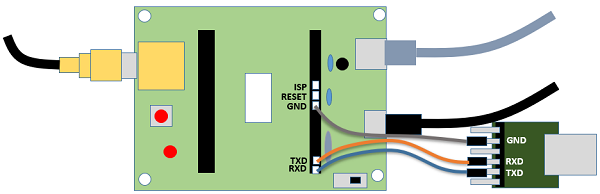 

転送前にTeraTerm等で通知チェック行うとベターです。  
その際に通信で利用するCOMポートも確認して下さい。

## 使い方

### ツールを起動する

Ichigotool.exeのアイコンをクリックして起動させます。 

  

### シリアルポートを設定する

ドロップダウンリストから、利用するCOMポートを指定します。  
ドロップダウンリストには、パソコンで利用可能なCOMポートが表示されます。

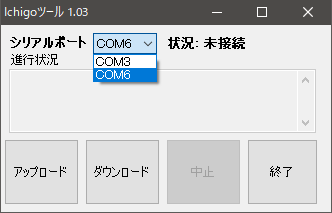  

### パソコンからIchigoJamへのアップロードする

「アップロード」ボタンを押してください。  
ファイル選択「開く」画面でアップロードするファイルを選択します。  

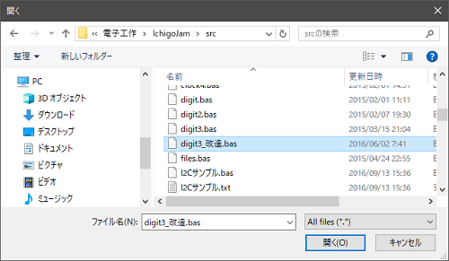  

確認画面「アップロードの実行」の「はい」を押します。

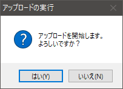  

通信状態となり、進行状況が表示されます。  
この時、IchigoJamの画面には、転送しているプログラムリストが逐次表示されます。  
完了までは、数十秒かかります。  
中断したい場合は「中止」ボタンを押します。  

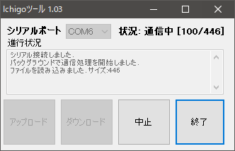  

アップロードが完了すると確認画面「アップロード終了」表示されます。  
「OK」を押します。

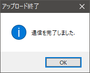  

状態が「完了」となります。  

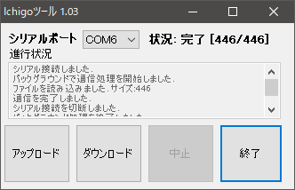  

### パソコンにIchigoJamからダウンロードする

「ダウンロード」ボタンを押してください。  
「名前を付けて保存」画面で保存先のフォルダ、ファイル名を指定します。  

確認画面「ダウンロードの実行」の「はい」を押します。

  

通信状態となり、進行状況が表示されます。  
ダウンロードはアップロードとは異なり、瞬時に完了します。

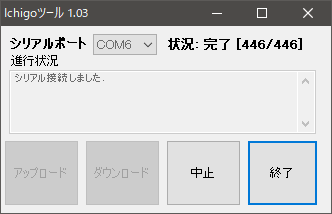  

ダウンロードが完了すると確認画面「ダウンロード終了」表示されます。  
ここで「はい」を押すと、メモ帳を開いてダウンロードしたプログラムの内容を表示します。  
メモ帳を開きたくない場合は「いいえ」を押します。

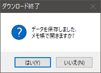  

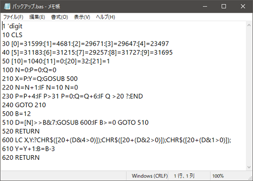  

ダウンロードが完了すると、ツールの状況は完了状態となります。  

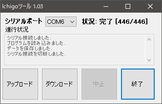  

## ツールのコンパイル等について

本ツールはWindows 10環境の「Visual BASIC」にて作成しています。
プロジェクトを読み込んでコンパイルするには、Visual Studio 2019」またはの「Visual Studio 2017」の「Visual BASIC」にて開発環境が必要です。

## ライセンスについて

本ツール及びプログラムソースは自由のお使い下さい。再配布も自由です。  
ただし、ツール及びプログラムソースの利用において問題が発生しても、一切の責任は持ちません。  

